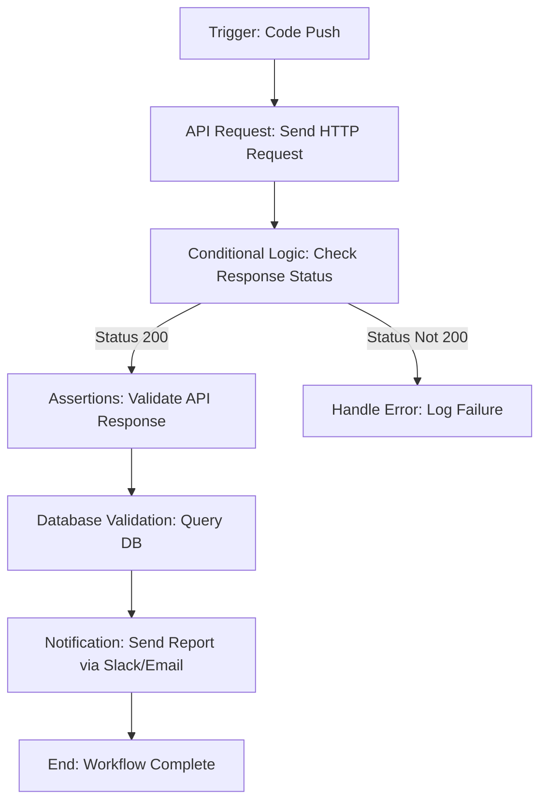
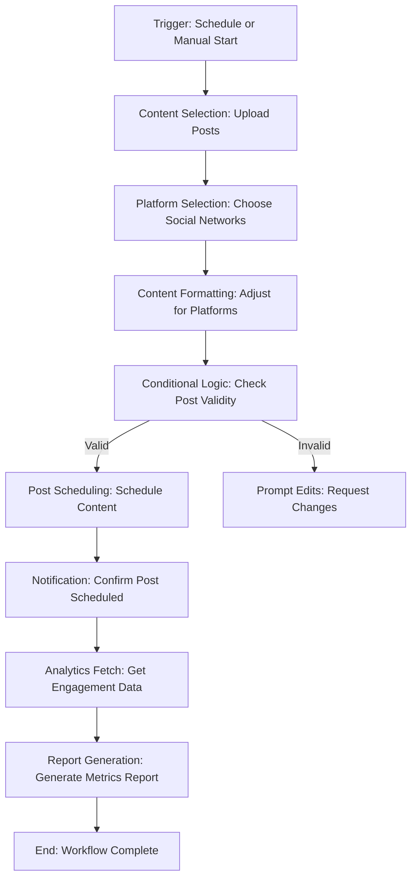
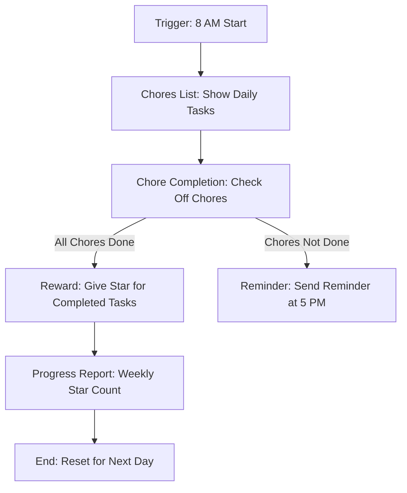

# Use case examples
There are some of the many use cases for developers, non-tech people and kids.
## For developers | Automated API Test Workflow

This workflow automates API testing for developers, making it easier to run tests without needing to write repetitive code. The workflow is triggered when new code is pushed to the repository and automatically runs a series of API tests and validations.

## Workflow Overview

1. **Trigger (Start Block)**:  
   Triggered by a webhook from a CI/CD pipeline (e.g., GitHub Actions) whenever code is pushed to the repository. This block initiates the workflow.

2. **API Request Block (Input Block)**:  
   This block sends HTTP requests to the APIs you want to test. It supports different HTTP methods (GET, POST, etc.) and allows parameterized inputs for dynamic testing.

3. **Conditional Logic Block**:  
   This block checks the response status codes from the API requests.  
   - If the status is 200 (OK), the workflow proceeds to the next step.  
   - If the status is anything other than 200, it follows an error-handling path.

4. **Assertion Block**:  
   This block validates the API responses by comparing them against expected results. You can configure this block to ensure that the JSON responses contain specific fields or values.  
   - If the assertions pass, the workflow continues.  
   - If they fail, errors are logged.

5. **Database Validation Block**:  
   After testing the APIs, this block checks if the database was updated correctly by running SQL queries. This ensures the APIs performed the correct operations on the data.

6. **Notification Block (Output Block)**:  
   Once all the API tests and validations are complete, this block sends a summary report (via email or Slack) detailing the test results. The report highlights both successful tests and any errors.

7. **End Block**:  
   Marks the workflow as complete. Optionally, it can log the results to an observability tool (e.g., Sonar) for further monitoring.

## Benefits for Developers

- **Automates Repetitive API Tests**: Save time by not having to write manual test scripts for each code push.
- **Visual Debugging**: Developers can see the entire testing process visually, making it easy to debug failed tests.
- **Customizable**: Each block (API request, assertions, etc.) can be customized, making it flexible to adapt to different API structures and environments.
- **Collaboration with Non-Technical Teams**: QA or non-technical team members can tweak the workflow without needing to know how to code.
- **Reusability**: These blocks can be reused in different workflows, providing modularity and consistency across tests.

## Workflow Diagram (MermaidJS)

# For non-tech people | Social Media Content Automation Workflow

This workflow allows non-technical users, such as marketing team members, to automate the process of posting content to multiple social media platforms without needing to write any code. The workflow handles everything from content selection to scheduling and reporting.

## Workflow Overview

1. **Trigger (Start Block)**:  
   The workflow can be triggered either manually or based on a scheduled time (e.g., every Monday at 9 AM). This block starts the content posting process.

2. **Content Selection Block (Input Block)**:  
   The user selects or uploads the pre-written social media posts, including text, images, and hashtags. Content can also be uploaded from a CSV file for batch scheduling.

3. **Platform Selection Block**:  
   The user chooses which social media platforms (e.g., Twitter, LinkedIn, Instagram) to post the content on. Different content can be scheduled for each platform if needed.

4. **Content Formatting Block**:  
   This block ensures the content is properly formatted according to the requirements of each platform (e.g., Twitter’s character limit or Instagram’s image dimensions).

5. **Conditional Logic Block**:  
   If any content doesn’t meet platform guidelines (e.g., too many characters for a Twitter post), the workflow either adjusts the content automatically or prompts the user to make changes.

6. **Post Scheduling Block**:  
   The content is scheduled to be posted at the desired times for each platform, either immediately or for future dates.

7. **Notification Block (Output Block)**:  
   Once the content has been scheduled, a notification (via email or Slack) is sent to confirm that the posts are scheduled or successfully published.

8. **Analytics Fetch Block**:  
   After the posts go live, this block automatically retrieves engagement data (e.g., likes, comments, shares) from each platform.

9. **Report Generation Block**:  
   A summary report with the engagement metrics is generated and sent via email or saved to a shared folder (Google Drive, Dropbox, etc.).

10. **End Block**:  
    The workflow completes, and the user has a complete view of the social media automation and results.

## Benefits for Non-Technical Users

- **No Coding Needed**: Easily automate social media content posting without writing code.
- **Saves Time**: Automates repetitive tasks like posting across multiple platforms, allowing users to focus on creating engaging content.
- **Consistency**: Ensures that posts go live on time and in the correct format for each platform.
- **Collaboration**: Anyone on the team can use the workflow, without needing technical expertise.
- **Automatic Analytics**: Automatically pulls engagement data and generates reports, saving time on manual data collection.

## Workflow Diagram (MermaidJS)

# For kids | Daily Chores Tracker Workflow

This workflow helps kids track their daily chores in a fun way. It automatically reminds them to do their chores, checks off tasks they’ve completed, and gives them stars for their hard work!

## Workflow Overview

1. **Trigger (Start Block)**:  
   The workflow starts every morning at 8 AM, sending a list of the day’s chores to the child (through a parent’s phone or an app).

2. **Chores List Block (Input Block)**:  
   A list of daily chores is presented to the child (e.g., "Make Your Bed," "Brush Your Teeth," "Clean Your Room"). They can view and choose which chores to do.

3. **Chore Completion Block**:  
   After completing a chore, the child can check off the task on their device (or tell a parent, who checks it off for them).

4. **Reminder Block**:  
   If a chore isn’t completed by a certain time (e.g., 5 PM), the workflow sends a friendly reminder to complete it.

5. **Reward Block (Conditional Block)**:  
   When all chores are completed, the child gets a reward! They earn a star for each completed task. If they get 5 stars in a week, they can unlock a special treat (like extra screen time or a fun activity).

6. **Progress Report Block**:  
   At the end of the week, the workflow sends a report to the child and their parents showing how many stars they earned and how well they did with their chores.

7. **End Block**:  
   The workflow finishes for the day once all tasks are completed, and it resets for the next day.

## Benefits for Kids

- **Fun and Easy**: Kids can track their daily chores in a fun, interactive way.
- **Reminders**: They’ll never forget to do their chores, thanks to automatic reminders.
- **Rewards**: Earn stars and special rewards for completing chores.
- **Progress Tracking**: At the end of the week, they can see how well they’ve done with their chores.

## Workflow Diagram (MermaidJS)

